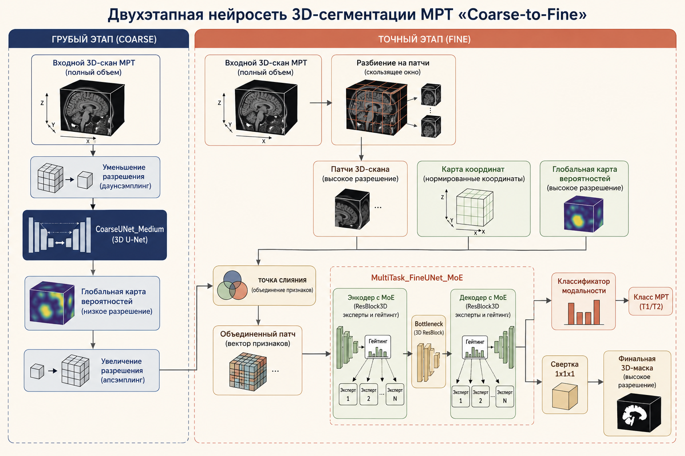

# 3D-сегментация МРТ: Двухэтапный Coarse-to-Fine подход


Этот репозиторий содержит модель для сегментации трехмерных медицинских изображений (МРТ). Проект разделен на две части: **быстрый запуск** (для демонстрации) и **технический разбор** (для тех, кто хочет изучить архитектуру).

---

## Часть 1. Быстрый запуск (для демонстрации и тестов)

Эта часть предназначена для тех, кому нужно быстро запустить проект на любом компьютере, не вникая в код и не скачивая гигабайты реальных МРТ-снимков.

### Как запустить демо за 3 шага:

**Шаг 1. Установите менеджер окружения `uv`**  
Если у вас еще нет `uv` (это очень быстрый аналог pip), установите его одной командой в терминале (PowerShell):
```powershell
powershell -c "irm https://astral.sh/uv/install.ps1 | iex"
```

**Шаг 2. Соберите проект**  
Перейдите в папку проекта и запустите сборку окружения. Утилита сама скачает стабильный Python 3.12 и установит нужные библиотеки:
```powershell
uv sync --python 3.12
```

**Шаг 3. Запустите симуляцию обучения**  
Просто введите команду ниже. Скрипт сам сгенерирует синтетические 3D-снимки в оперативной памяти и проведет быстрое тестовое обучение на 3 эпохи:
```powershell
uv run python src/training_pipeline.py
```
*Что вы увидите:* в консоли побежит прогресс-бар, показывающий, как Coarse- и Fine-модели учатся распознавать сгенерированные объекты.

---

## Часть 2. Детальный разбор (для ML-инженеров)

Эта часть описывает архитектурные и инженерные решения, заложенные в проект.

### 1. Архитектура Coarse-to-Fine (Грубый-к-Точному)
Главная проблема при работе с 3D МРТ — огромный размер сканов при жестких ограничениях видеопамяти. Нарезать снимок на случайные патчи в лоб нельзя, так как теряется глобальный анатомический контекст. Мы решили эту проблему двухэтапным пайплайном:

*   **Грубый этап (Coarse)**: Быстрая и легкая сеть `CoarseUNet_Medium` обрабатывает весь снимок целиком, но в уменьшенном разрешении (например, сжатом до $128 \times 128 \times 128$). Ее задача — выдать грубую карту вероятностей нахождения объекта.
*   **Точный этап (Fine)**: Тяжелая сеть `MultiTask_FineUNet_MoE` нарезает снимок на патчи высокого разрешения. На вход она принимает многоканальный тензор:
    1.  Локальный патч оригинального изображения.
    2.  Кусок грубой маски от первого этапа (дает анатомический ориентир).
    3.  Координатную сетку вокселей (нормализованную в $[-1, 1]$), чтобы сеть «знала» свое абсолютное положение в пространстве.

### 2. Ключевые фичи моделей и пайплайна
*   **Mixture of Experts (MoE)**: Вместо классических сверточных блоков в точной сети используются слои `MoELayer` [1]. Данные обрабатываются параллельными экспертами (`ResBlock3D`), а небольшая распределяющая сеть (`gating_network`) динамически вычисляет веса для объединения их выходов. Это сильно увеличивает емкость модели.
*   **Multi-Task Learning**: Fine-сеть не только сегментирует, но и решает задачу классификации модальности МРТ (T1, T2 и т.д.) через бутылочное горлышко (bottleneck). Это заставляет ее извлекать более устойчивые и обобщенные признаки.
*   **Численная стабильность**: Функция потерь `DiceBCELoss` переведена на использование `F.binary_cross_entropy_with_logits` вместо связки `sigmoid + BCE`. Это предотвращает затухание градиентов и появление `NaN` при сильной уверенности сети.
*   **Отказоустойчивый инференс**: Обертка `UnifiedPatchedModel` реализует метод скользящего окна. Если входной скан по какой-то оси меньше размера патча, алгоритм рассчитывает корректный анизотропный падинг, предотвращая падение по ошибке несоответствия размерностей.

### 3. Структура кода
*   `src/data_units.py`: Содержит логику препроцессинга (приведение к изотропному вокселю, нормализация интенсивности по квантилям), H5-генератор и Mock-генератор данных.
*   `src/models.py`: Код нейросетей, блоков MoE [1], гейтинга и классификатора.
*   `src/inference.py`: Обертка для скользящего окна инференса и сборки патчей.
*   `src/training_pipeline.py`: Основной тренировочный цикл под управлением Hydra [1].
*   `tools/visualize_inputs.py`: Интерактивный инструмент на Matplotlib с ползунками для подбора оптимального порога бинаризации на валидационной выборке.

### 4. Полноценный запуск (Production)
Для запуска обучения на реальном HDF5-файле с рабочими гиперпараметрами:
```powershell
uv run python src/training_pipeline.py dataset=real mode=prod
```
*Настройки путей к H5 и параметры обучения вынесены в файлы `configs/dataset/real.yaml` и `configs/mode/prod.yaml` соответственно [1].*

### 5. Контроль версий весов
Чтобы большие файлы моделей (`.pth`) сохранялись в Git LFS, а автогенерация Hydra игнорировалась, проект поставляется с готовыми `.gitattributes` и `.gitignore`. 

Для активации отслеживания чекпоинтов:
```powershell
git lfs install
git lfs track "checkpoints/*.pth"
```